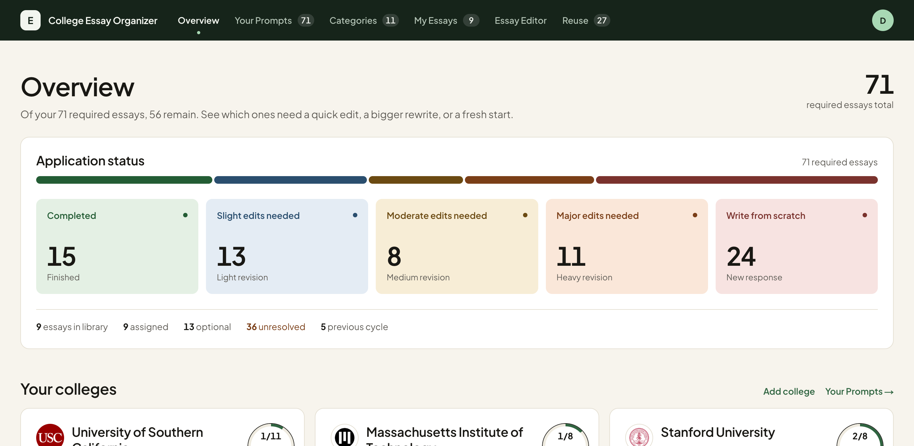
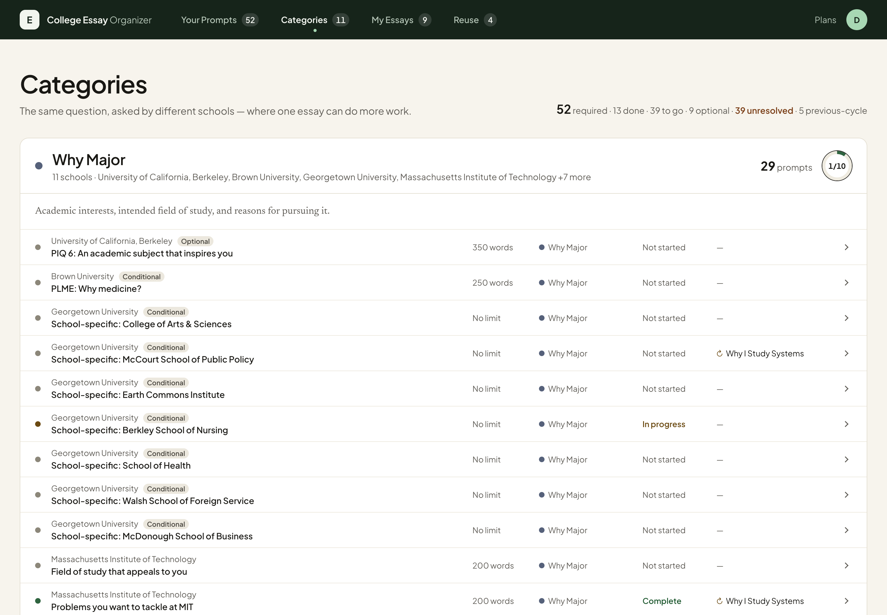

# College Essay Organizer

A private workspace for managing the supplemental-essay workload of a real
college application list — built around the observation that a student applying
to 15–25 schools faces 100+ prompts, and that a large share of them are asking
variations of the same handful of questions.

The product exists to make that overlap visible, so the student builds **a
reusable library of essays instead of starting from scratch at every college**.



## The model

```
Schools → Prompts → Essay categories → Essays → Reuse opportunities
```

| View | What it answers |
|---|---|
| **Overview** (`/`) | How much work is there, how much is done, and where can one essay do double duty? |
| **Your Prompts** (`/schools`) | Every prompt grouped by college as a card of compact rows, filterable by college, category, status, or text. |
| **Categories** (`/families`) | The same prompts grouped by the eleven-category taxonomy — *Why Major — 61 prompts across 31 schools* — so cross-school overlap is obvious. |
| **My Essays** (`/essays`) | The essay library: drafts, immutable versions, and a ribbon of the colleges each essay can actually go to. |
| **Reuse** (`/reuse`) | Per essay: prompts it already answers, prompts it could answer, and prompts it must **not** be reused for. |



## Two workspaces

Switch between them in the account menu at the top right. They never share records.

- **My workspace** — created empty when you sign up, private to your account. You add your own colleges with
  **Add a college**, which imports that school's current-cycle prompts from the
  curated registry and classifies them automatically. Colleges can be renamed or
  removed (with a confirmation step) at any time.
- **Example workspace** — a reproducible demo seeded by running the *same* import
  pipeline over 20 real schools, plus 9 clearly labelled sample essays: all
  eleven categories and real reuse opportunities, including the case a student
  most needs to see — an essay that names one college and must **not** be
  recycled at another. "Reset example" rebuilds it from scratch and never touches
  your own work. The sample essays are synthetic and labelled as such; they are
  nobody's real writing.

## Quick start

Requires Node.js 20+ and a Postgres database. [Neon](https://neon.tech) is what
this is built and deployed against; its free tier is enough.

```bash
npm install
cp .env.example .env.local     # paste your Neon pooled connection string
npm run db:migrate             # apply the committed migrations
npm run dev                    # http://localhost:3000
```

`.env.local` is gitignored. See [Accounts and access control](#accounts-and-access-control)
for `AUTH_SECRET`, which is optional locally and required in production.

The personal workspace and its taxonomy are created automatically on first
request, so a freshly migrated database opens to an empty workspace ready for
its first college.

Useful scripts: `npm run db:generate` (after an intentional schema change),
`npm run db:studio` (browse the data), `npm run db:migrate` (apply migrations).

## Accounts and access control

Sign-up is open: anyone with the URL can create an account at `/sign-up`, and
each account gets its own private workspace. Sign-in is at `/sign-in`. The gate
lives in [`src/proxy.ts`](src/proxy.ts) (Next.js 16 renamed `middleware.ts` to
`proxy.ts`), with credential and session logic in [`auth.ts`](src/lib/auth.ts)
and accounts in [`users.ts`](src/lib/users.ts).

```bash
AUTH_SECRET="a long random string"   # signs session cookies
```

```bash
node -e "console.log(require('node:crypto').randomBytes(32).toString('base64url'))"
```

How it works:

- **Passwords are hashed with scrypt** (`node:crypto`, so no dependency), with a
  random salt per password and the parameters stored in the hash so they can be
  raised later without invalidating existing accounts.
- **Sessions are stateless.** The cookie holds the user id, an expiry (30 days),
  and an HMAC over both, so the gate needs no database read. The signature
  covers the user id *and* the expiry, so neither can be swapped. The trade is
  that a single session cannot be revoked — rotating `AUTH_SECRET` signs
  everyone out.
- The cookie is `httpOnly`, `sameSite=lax`, and `secure` in production.
- **It fails closed in production.** Without `AUTH_SECRET` no session can be
  verified, so every route redirects to a sign-in page that says so rather than
  serving anyone's essays. Development runs ungated while it is unset.
- Sign-in and sign-up render under a deliberately minimal root layout, so they
  work even when the database is unreachable. The sidebar and its workspace
  queries live in the `(app)` route group, behind the gate.
- Unknown email and wrong password give the same message, and an unknown email
  still runs a hash comparison, so neither the response nor its timing reveals
  whether an account exists.
- The post-sign-in redirect is validated to be a same-site path, so the pages
  cannot be turned into an open redirect.

### Workspace isolation

Every table is scoped by `workspaceId`, every query filters on it, and every
mutation verifies the record belongs to the active workspace before writing.
On top of that, **the active-workspace cookie does not carry a workspace id** —
it only selects between "my own workspace" and "the shared example". A user can
therefore only ever reach their own personal workspace or the demo, even by
editing cookies. This is verified by test and by pointing one account's cookie
at another's workspace id, which returns the attacker's own empty workspace.

The example workspace is deliberately shared by everyone: it holds no personal
data by construction, and anyone can rebuild it with "Reset example".

Remaining gaps, stated plainly: there is **no rate limiting** on sign-in or
sign-up, no email verification, and no password reset. Anyone with the URL can
create an account, which is what open sign-up means — so the deployment's
storage is only as bounded as its obscurity.

## How prompts get into the app

Prompt text is **not** scraped at runtime and not generated by a model. It comes
from a committed, typed registry of school records under
[`src/lib/retrieval/sources/`](src/lib/retrieval/sources/), each one researched
against that institution's own admissions pages and carrying its source URL,
cycle label, and a note explaining what was and was not confirmed.

Every school in the 100-school picker has exactly one outcome, and the
distinction between them is deliberately preserved rather than flattened:

| Outcome | Schools | Meaning |
|---|---|---|
| `officially-verified` | 46 | Exact current-cycle wording published on an official page. |
| `no-supplement-confirmed` | 12 | Officially confirmed to require no supplement. |
| `needs-review` | 36 | Official sources checked, but exact wording was not publicly available (portal-only text, missing cycle label, or incomplete conditional coverage). Imports **zero** prompts rather than guessing. |
| `previous-cycle` | 6 | Official wording from 2025–26 only. Imported as planning material, labelled in the UI, and excluded from current-cycle completion counts. |

255 prompts are curated in total. A school that isn't in the registry can still
be added by hand — it just arrives with no prompts and a note saying so.

Re-importing a school is idempotent: prompts are matched on a stable
`externalRef`, unchanged prompts are left alone, and a prompt whose official
wording has changed is flagged `needs-review` with the previous text recorded in
`prompt_change_log`.

## The eleven categories

```
Community · Identity & Background · Challenge & Growth · Activities & Impact
Why Major · Why Us · Personal Statement · Short Answer · Roommate
Reading List · Other
```

Two of these are worth explaining, because both were arrived at by measurement
rather than taste:

- **Personal Statement means "choose essentially any topic you want"** — nothing
  more. It holds **2** of the 255 catalogue prompts. A broad, reflective prompt
  about community belongs in Community. Letting it drift back into a catch-all is
  what previously made any two of 106 prompts read as a strong match.
- **Other means a genuinely bespoke framing**, not "unclassified". It is the
  largest category at **80 of the 255 catalogue prompts** (a given workspace sees
  fewer — a 36-college list holds 40), and it participates in matching through its
  secondary themes rather than being excluded — otherwise a third of the
  catalogue would match nothing a student had ever written.

Seventeen **secondary themes** sit underneath (Contribution, Intellectual
Curiosity, Values, Creativity, Disagreement, Leadership, Service…). Six of them
are also primary categories; the rest exist only as themes. A category is never
repeated among its own secondaries.

## How classification works

Catalogue prompts are **not** classified by keyword matching. All 255 carry a
hand-reviewed primary category, secondary themes, and prompt function, committed
as data in [`category-review.ts`](src/lib/retrieval/category-review.ts) and
generated from a reviewed spreadsheet
([`docs/evaluation/source-review.csv`](docs/evaluation/source-review.csv)) by
`scripts/regenerate-category-review.mts`. Changing a classification means editing
that spreadsheet and re-running the script.

The keyword classifier in [`classification.ts`](src/lib/classification.ts)
remains, and does two jobs: classifying prompts a student adds that are not in
the catalogue, and deriving secondary themes from an essay's own text. A student
can override any classification, recorded as `source: 'manual'`, and no automated
pass — import, migration, or reclassification — may overwrite it.

## How reuse is scored

Four independent factors, summed to a score out of 100. **Nothing is
subtracted**: school-specific material and word count are *editing cost*, and
they lower the band through ceilings rather than the score, so the score answers
"does this essay answer this prompt?" and the band answers "how much work is
it?".

| Factor | Weight | What it reads |
|---|---|---|
| Primary category | 25 | Do they want the same *kind* of essay? |
| Semantic similarity | 40 | Do the actual texts mean the same thing? |
| Secondary overlap | 20 | 7 points per shared theme, capped at 20 |
| Prompt function | 15 | Does the essay *do* what the prompt asks? |

Primary category is deliberately the **smallest** factor. An earlier design gave
it 60 points on top of a 20 baseline, landing exactly on the threshold for "ready
to reuse" — so two prompts sharing a broad category were called ready to submit
unchanged, and nothing in the score ever read the essay.

**Prompt function** is the factor students most need and least expect: *"describe
a community that shaped you"* and *"how will you contribute to our community"*
share a topic and want different essays. Each prompt is labelled with one of
eight functions (describe, reflect, explain impact, demonstrate growth, explain
motivation, discuss future contribution, connect to school, state a future goal),
and a mismatch across the retrospective/forward boundary caps the band no matter
how high the score.

### Four bands, and no "ready to reuse"

Essentially every reused essay needs some tailoring, so no label claims
otherwise:

| Score | Label |
|---|---|
| 70–100 | Reusable with slight edits |
| 60–69 | Reusable with edits |
| 50–59 | Reusable with significant edits |
| < 50 | New response recommended |

The 60–69 / 50–59 split is load-bearing: **68** means "a reasonably strong
foundation", **52** means "substantial material is salvageable but expect to
rewrite most of it".

An essay that names one school is flagged **high risk** against a different
school's fit prompt and capped, never quietly hidden — a strong Stanford "Why Us"
essay is a genuinely useful starting point for Duke, it simply cannot be
submitted unchanged.

## Semantic similarity runs locally

The only model in the project. [`embedding.ts`](src/lib/embedding.ts) runs
`all-MiniLM-L6-v2` through ONNX **on this machine**: no API key, no network at
inference time, and no essay text leaves the process — the same privacy
constraint that ruled out third-party document sync.

Two details that are not optional, both found by measuring rather than reasoning:

- **One text per call.** Batching pads every text to the longest in the batch and
  mean-pools over the padding, so a text's vector depends on its neighbours —
  measured at cosine 0.991 between the same prompt in two different batches,
  against 1.000000 embedded twice alone. It is also *faster*, because padding
  wastes compute.
- **Similarity is calibrated, never raw.** Real cosines from this model sit in a
  narrow 0.02–0.25 band: an essay about rebuilding a free library scores 0.253
  against the prompt it answers and 0.020 against "why engineering at Princeton".
  Real signal, unreadable by any absolute threshold. Each prompt is z-scored
  against that essay's own distribution, which asks the question that matters —
  *is this prompt closer than the average prompt?*

The weights are **committed** under [`models/`](models/) (~23MB) and loaded with
`allowRemoteModels` off, so production has them and inference never reaches the
network. They were not committed at first, and the failure was instructive: the
serverless filesystem is read-only, the download had nowhere to land, and the app
ran on three factors with no error anywhere. A test now asserts the weights ship
and that the build is told to include them, because nothing else would notice.

**With no model available the whole app still works.** Semantic similarity scores
its neutral value, every band stays reachable, and nothing errors. That fallback
is the rollback path for the feature, and it is the path the entire test suite
runs on.

## Origin prompts

The matcher knows what an essay *does* because the student can say which prompt
it was written for — either picking one from their college list or pasting a
prompt from outside it (a scholarship, a class assignment, a college not yet
added). An essay started from a prompt records it automatically.

Origin is deliberately **not** the same as an assignment. Assignments are
many-to-many and grow every time a suggestion is accepted; origin is one prompt
and never moves. Conflating them let a later assignment redefine what an essay
was — the suggestion the student accepted would become the evidence for itself.

Function is resolved in a fixed order of authority: explicit catalogue origin →
pasted origin, classified from its text → earliest assignment, for essays
predating this → the essay's own text → unknown, which scores neutral rather than
as a mismatch. Existing essays stay null and keep working.

## The interface

Horizontal top navigation on a warm off-white ground. Four sections, the
wordmark leading back to Overview, and the account controls behind an avatar
menu that uses the native `popover` attribute — Escape, light-dismiss and
top-layer stacking with no JavaScript.

**Cards for things you act on, rows for things you scan.** A college, an essay,
a category group and a stat tile are cards. A prompt, an essay version, a reuse
suggestion and a match are compact rows, hairline-separated inside their card,
taking their breathing room from row height and card padding rather than from a
border and shadow each. A card inside a card is treated as a defect.

**Two typefaces, doing different jobs.** Plus Jakarta Sans carries the whole
interface; Newsreader is confined to the two surfaces where paragraphs are
actually read — a prompt's own wording and an essay's text. Both are
self-hosted at build time, so there is no runtime request to Google and no
layout shift.

**Every college has an identity mark**: its initials on one of twelve curated
colours, picked deterministically from the name. The colours are a vetted list
rather than a hue derived from a hash, because a free hue can land somewhere
illegible; `src/app/contrast.test.ts` asserts that every one carries white
initials at AA and sits at 3:1 against the card surface.

A college's own logo replaces the initials where one is available — 51 of the
100 researched colleges publish an icon large enough to use, taken from the
icon their own homepage declares, so it cannot be another school's mark. **This
is off by default and no logo files are committed**, because a logo is a
trademark rather than a licensable image: see
[docs/school-logos.md](docs/school-logos.md) for the three gates and the
reasoning. Campus photography is a separate question with its own answer in
[docs/school-photos.md](docs/school-photos.md); no photographs are in use.

**The reuse ribbon** is the one place the design raises its voice. Each essay
card carries a row of college marks showing where that essay can actually go,
each ringed by its reuse band. It puts the product's argument — one essay, many
prompts — on screen at a glance. Every mark is a link whose accessible name
states the college and the band in words, so colour is never load-bearing.

Composed for 1440px and for larger displays up to 2880px, where grids gain
columns rather than stretching cards: the college grid goes from three columns
to five. Below 900px the app stays usable rather than polished — mobile
optimisation is deliberately deferred.

### Accessibility

`src/app/contrast.test.ts` parses `src/app/styles/tokens.css` and asserts WCAG
AA on every declared foreground/background pair — 4.5:1 for text, 3:1 for the
boundaries of things you operate — plus a guard that every colour in the
palette is either checked or listed as decorative with a stated reason, so a
colour cannot be added without being contrast-checked.

Hairlines between surfaces and pill fills are the documented exceptions: a card
reads as a card because it is white on cream, and a pill always carries its own
text, so neither depends on its border to be perceived.

Beyond contrast: `aria-current="page"` is reserved for the active navigation
item; filter chips are removal links, named for what activating them does, and
carry neither `aria-pressed` nor `aria-current`; progress is a real
`progressbar` with an accessible name and a visible fraction, and degrades to
plain decoration when there is nothing to measure rather than claiming "0 of 0
complete"; focus is always visible, with a lighter ring reserved for the dark
navigation bar; and `prefers-reduced-motion` disables every transition.

### Style organisation

`globals.css` was 2311 lines of undifferentiated rules. It is now a short list
of imports:

```
src/app/styles/
  tokens.css       colour, type, space, radius - no selectors
  base.css         reset, document defaults, focus, reduced motion
  primitives.css   card, pill, ring, mark, row, controls
  features/        nav, shell, auth, overview, filters, prompts,
                   prompt-detail, forms, essays, categories, reuse,
                   credits, plans
```

A two-direction sweep checks that every rule is used and every class in the
markup is styled, because an orphan rule and a missing rule are different bugs.

## Architecture

Next.js App Router with React Server Components on Postgres (Drizzle ORM),
deployed on Vercel with Neon. Every mutation is a server action driven by a
plain `<form>`; the only client component in the app is the one that marks the
current section in the top navigation. Progressive disclosure is done with
`<details>` and URL parameters, and the account menu uses the native `popover`
attribute, so the interface works without JavaScript.

Nothing is prerendered — every route reads the workspace cookie and the
database — so the root layout declares `force-dynamic` and the build needs no
database connection.

```
src/app/
  layout.tsx            minimal root: no database, so /sign-in always renders
  sign-in/, sign-up/    the auth pages, sharing one AuthCard
  auth-actions.ts       sign up / sign in / sign out
  proxy.ts (src/)       the auth gate, in front of every route
  (app)/layout.tsx      top navigation, account menu, workspace switch
  (app)/page.tsx        Overview dashboard
  (app)/[section]/      Your Prompts / Categories / My Essays / Reuse
  (app)/plans/          reads the local plan files in ~/.claude/plans
  (app)/photo-credits/  image attribution, and the independence notice
  prompt-ui.tsx         the shared prompt row used by two views
  school-mark.tsx       a college's identity mark: initials on a vetted colour
  catalogue-state.tsx   what a college with no prompts on file actually means
  filtering.ts          the filter predicates, lifted out so they are testable
  styles/               tokens, base, primitives, one partial per view
  *-actions.ts          server actions (auth, college, school, prompt, essay)
src/lib/
  retrieval/            typed school records + registry + validation
  college-import.ts     the single "Add College" entry point
  classification.ts     deterministic prompt classifier
  matching.ts           deterministic essay↔prompt scorer
  reuse.ts              recomputes every match for a workspace
  progress.ts           derived UI numbers (nothing persisted)
  essays.ts             essay CRUD with immutable versions
  auth.ts               scrypt hashing + stateless signed sessions
  users.ts              accounts and their personal workspaces
  school-photos.ts      campus photographs and their required provenance
  school-logos.ts       college logos, off by default; see docs/school-logos.md
  db/                   Drizzle schema, migrations, seeds, demo workspace
    client.ts           Neon pool for the app, PGlite for tests
    server.ts           cached pool + one-time workspace initialization
```

**The data layer is entirely async.** No Postgres driver is synchronous, so
every function that touches the database returns a promise, all the way up
through the server actions. An un-awaited call here is silent data loss — the
action returns, the page revalidates against stale rows, and on serverless the
instance can be frozen mid-write — so `no-floating-promises` and
`await-thenable` are enabled as errors. Worth knowing: those rules do **not**
recognise a Drizzle query builder as thenable, so they cannot catch an
un-awaited builder; the persistence tests are what covers that.

**Workspace isolation** is enforced at the data layer, not the UI: every query
is scoped by `workspaceId`, and every mutation verifies the record belongs to
the active workspace before writing. Attempting to link a personal prompt to a
demo category throws.

**Derived, never duplicated.** Progress, completion, and reuse counts are
recomputed from the snapshot on every render
([`progress.ts`](src/lib/progress.ts)) rather than stored, so they cannot go
stale. Completion counts deliberately cover current-cycle prompts only.

## Data model

16 tables under [`src/lib/db/schema.ts`](src/lib/db/schema.ts). The parts worth
knowing:

- `essays` holds current content; `essay_versions` is append-only. Editing never
  overwrites — it writes a new version, and restoring an old one also writes a
  new version, so history is never destroyed.
- `prompt_family_links` / `essay_family_links` carry one primary plus many
  secondary categories, with a partial unique index enforcing "at most one
  primary".
- `essay_prompt_matches` is a full recompute, not an incremental cache, so a
  stale match cannot survive an edit.
- `assigned_essay_responses` has a unique index on `prompt_id`: a prompt has at
  most one current response. It answers "where is this essay used", which is a
  different question from `essays.origin_prompt_id` — "what was it written for".
  The latter is a nullable FK with `on delete set null`, so an essay outlives the
  prompt record it came from.

## Verification

```bash
./run_tests.sh
```

Runs ESLint (including type-aware promise rules), a strict TypeScript check,
the Vitest suite (279 tests), a production build, and the 103-assertion
overnight-orchestration suite.

The suite runs with embeddings **disabled**, so every assertion holds identically
on a machine with the model cached and one without — a test whose result depends
on whether a 25MB download happened is flaky, not passing. Two files opt back in
and skip themselves when the model is genuinely absent, so the real path is still
covered.

The persistence tests run against **PGlite** — real Postgres compiled to WASM,
in-process — applying the same committed migrations as production. So `jsonb`,
`timestamptz`, check constraints and partial unique indexes are all exercised
on the dialect that actually ships, while each test still gets a throwaway
database. It needs no network and no credentials.

Individually: `npm run lint`, `npm run typecheck`, `npm test`, `npm run build`.

## Limitations and known gaps

Recorded honestly rather than papered over:

- **The serverless function is large, and its true size is not established.**
  `vercel inspect` reports 2.96MB before embeddings, 219.19MB with the
  dependency, and 227.23MB once the weights were added — but that figure did not
  move when `scripts/prune-onnx-binaries.mjs` verifiably deleted ~176MB of
  unusable platform binaries (the build log confirms four platforms removed), and
  it rose by only 8MB for 23MB of weights. Both facts contradict reading it as a
  sum of included files, so what it measures is unclear and it should not be
  quoted as headroom against Vercel's 250MB limit. What is established: the prune
  runs, `outputFileTracingExcludes` did not work for an external package, and
  cold starts are slower than a 2.96MB function's.
- **Prompt-function inference is 76.7% precise**, measured against the reviewed
  catalogue on the 45% of prompts where it commits to an answer. It is only used
  for prompts outside the catalogue and for legacy essays; every catalogue prompt
  carries a reviewed function instead. It deliberately answers "unknown" rather
  than guessing, because a wrong function costs 15 points and can cap a band
  while an unknown one scores neutral.
- **Coverage is 51.5% on the prompts where reuse is the point.** A six-essay
  portfolio finds reusable material for about half a ten-college list, once Why
  Us, Short Answer, Roommate and Reading List are excluded — those are bespoke by
  construction and telling a student to write them fresh is correct advice.
- **No real essays have been evaluated.** Every number in
  [`docs/evaluation/`](docs/evaluation/) comes from catalogue prompts standing in
  for essays, or from the nine synthetic demo essays. That bounds the answer
  rather than settling it.
- **36 of 100 schools import no prompts** (`needs-review` above). This is a
  data-availability limit, not a bug, and each record says exactly what was
  unresolved.
- Open sign-up with no email verification, no password reset, and no rate
  limiting on sign-in or sign-up. Accounts are properly isolated from each
  other, but nothing stops a stranger who finds the URL from registering.
- The example workspace is shared across all accounts, and anyone can rebuild
  it. That is intentional (it holds no personal data) but means one user's
  "Reset example" is visible to another.
- Migrations are applied manually (`npm run db:migrate`), deliberately not on
  boot: concurrent serverless instances racing migrations is how a schema gets
  corrupted.
- The editing-suggestion workflow (prompt-fit / clarity / concision suggestions
  with individual accept and reject) is specified but not built.
- JSON export/import of a whole workspace is specified but not built.
- Layout is verified at 1440 / 1200 / 1024 / 768 px; 390 px has not been
  verified on a real device.
- The origin-prompt UI is built and tested but has not been exercised by a real
  user in production; the data layer is verified directly instead.
- Scores stored before the model shipped were computed with it (from a local
  run), so they already reflect four factors. Any workspace whose matches predate
  that will be rewritten on its next recompute.

## Where AI would slot in later

The deterministic layer is deliberately shaped so a model could be added
*beside* it, never underneath it:

- `classifyText()` and `scoreMatch()` are pure functions with explicit return
  shapes. A model-backed implementation could return the same shape, and the
  `classificationSource` column already distinguishes `deterministic` from
  `manual` — a third value is the only schema change needed.
- The embedding layer is the working proof of that shape: a real model was added
  as one factor of four, behind a null-returning interface, without any other
  part of the system learning that it exists.
- Prompt retrieval is already separated into typed source records with citations,
  so a model could *propose* a record for human confirmation without ever
  writing directly to the prompt table.
- Editing suggestions were specified from the start as discrete accept/reject
  items that create new immutable versions, which is what makes model-generated
  edits reviewable instead of destructive.

Anything model-generated should stay clearly labelled and never silently
replace a cited official prompt.

## Project documents

- [docs/reuse-scoring.md](docs/reuse-scoring.md) — the authoritative scoring
  design: every weight, band, ceiling, and the reasoning behind each.
- [docs/evaluation/](docs/evaluation/) — what was measured and what it showed,
  including the numbers that contradicted earlier conclusions:
  [reuse-scoring.md](docs/evaluation/reuse-scoring.md) (65,025-pair run),
  [qualitative-review.md](docs/evaluation/qualitative-review.md) (cases judged by
  reading them), [other-audit.md](docs/evaluation/other-audit.md),
  [secondary-diagnosis.md](docs/evaluation/secondary-diagnosis.md),
  [reconciliation.md](docs/evaluation/reconciliation.md).
- [docs/adaptation-workflow.md](docs/adaptation-workflow.md) — specification for
  school-specific adaptation, deliberately not built.
- [MVP_SPEC.md](MVP_SPEC.md) — the product specification this is built against.
- [AGENT_HANDOFF.md](AGENT_HANDOFF.md) — live status, decisions, and what's next.
- [OVERNIGHT_TASK.md](OVERNIGHT_TASK.md) — operating rules for autonomous runs.
- [CLAUDE.md](CLAUDE.md) — repo instructions for coding agents.
