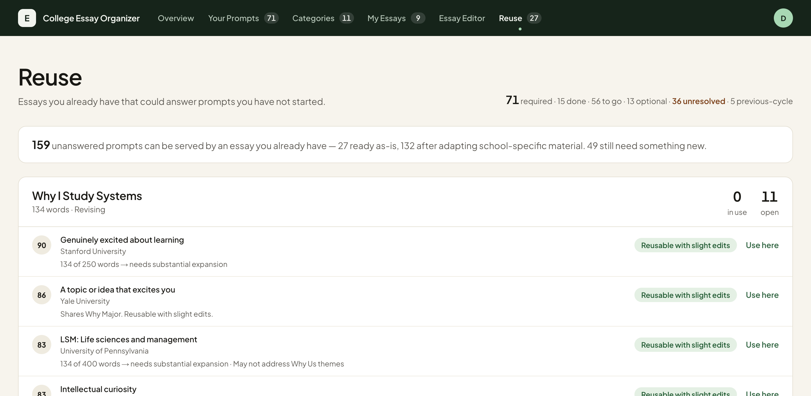
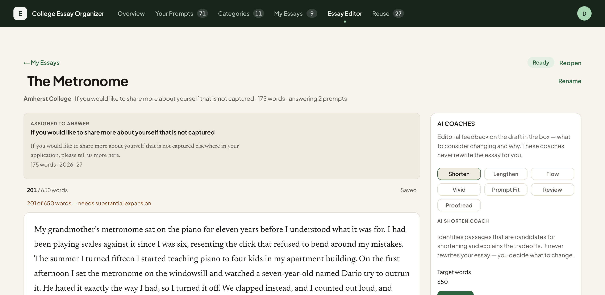

# College Essay Organizer

If you apply to 20 colleges, you end up staring at something like 100
supplemental essay prompts. A lot of them are secretly the same question. Six
schools all want to know why you picked your major, and four want to know what
community shaped you.

This app makes that overlap visible. You add your colleges, it pulls in their
verified 2026-27 prompts and sorts them into categories, and then it tells you
which prompts an essay you already wrote can answer. The goal is that you end
up with a small library of good essays rather than 100 blank pages.

**Live:** https://college-essay-organizer.vercel.app (sign-up is open)


## What it does

**Imports real prompts.** Type a college name and it loads that school's
current prompts from a catalogue I built by hand: 100 colleges, 553 prompt
records, each one carrying a citation back to where it came from. 95 of the 100
have prompts on file. Anything unresolved says so instead of quietly showing
zero.

**Sorts prompts into 11 categories.** Why Major, Why Us, Community, Identity &
Background, Challenge & Growth, Activities & Impact, Personal Statement, Short
Answer, Roommate, Reading List, Other. A prompt gets one primary category and
any number of secondary ones. Classification is deterministic, so you can read
why a prompt landed where it did.


**Scores reuse.** For every essay and every prompt you have not answered, it
computes a 0-100 score from four factors: category match, semantic similarity,
word-count fit, and prompt function. Scores become one of four bands, from
"reusable with slight edits" down to "write something new". It also flags the
case that actually matters, which is an essay that names one college and must
not be sent to another.



**Writes and edits.** There is a full essay editor with immutable version
history. Editing never overwrites; it appends a version, and restoring an old
one also appends, so nothing is destroyed.

**Seven AI coaches.** Shorten, Lengthen, Flow, Vivid, Prompt Fit, Review and
Proofread. They give editorial feedback anchored to quoted passages from your
draft and explain the tradeoff. They deliberately do not rewrite your essay for
you, because a college essay a model wrote is not worth submitting. Only
Proofread may suggest replacement text, and only for the exact phrase it
quoted.



## How the matching works

The scoring is plain code, not a model deciding things. Four factors:

| Factor | What it measures |
|---|---|
| Category | Does the essay's category match the prompt's? |
| Semantic | Cosine similarity between sentence embeddings of the two texts |
| Length | Does the essay fit the prompt's word limit, and how far off is it? |
| Function | Does the prompt want a story, an argument, a list, a school-specific answer? |

The semantic factor runs a local ONNX sentence model (`Xenova/all-MiniLM-L6-v2`,
int8 quantized, about 23MB) with the weights committed to the repo, so it works
on Vercel where the filesystem is read-only. If the model fails to load, that
factor scores neutral and the app says so in the logs instead of pretending.

Catalogue prompt vectors are precomputed and committed, so the numbers in
`docs/evaluation/` are reproducible from the repo.

## Tech stack

- Next.js 16 App Router, React 19 Server Components
- Postgres via Drizzle ORM. Neon in production, PGlite (Postgres compiled to
  WASM) in tests, running the same committed migrations
- Tailwind CSS 4
- `@huggingface/transformers` for local ONNX embeddings
- Travila API for the AI coaches
- Deployed on Vercel

Almost everything is a Server Component. Every mutation is a server action
behind a plain `<form>`, and there is exactly one client component in the whole
app (the thing that highlights the current nav item). Progressive disclosure
uses `<details>` and URL parameters, and the account menu uses the native
`popover` attribute, so the app works with JavaScript turned off.

Data isolation is enforced in the data layer, not the UI. Every query is
scoped by workspace id, and every mutation checks the record belongs to the
active workspace before writing.

## Running it locally

You need Node.js 20+ and a Postgres database. I used [Neon](https://neon.tech)
and its free tier is enough.

```bash
npm install
cp .env.example .env.local     # paste your connection string into DATABASE_URL
npm run db:migrate             # apply the committed migrations
npm run dev                    # http://localhost:3000
```

Sign up at `/sign-up` and you get an empty private workspace. Add a college and
its prompts import and classify themselves.

To get a populated workspace to look around in:

```bash
npm run db:seed-example
```

That builds the shared example workspace by running the real import pipeline
over 20 colleges (144 prompts) and adding 9 sample essays. The sample essays are
written for the demo and labelled as such in the UI. They are nobody's real
writing. The example workspace is read-only and shared across accounts.

Environment variables, all documented in `.env.example`:

- `DATABASE_URL` is required.
- `AUTH_SECRET` signs the session cookie. It is required in production; without
  it the app refuses every request rather than serving essays unprotected.
  Local development runs ungated while it is unset.
- `TRAVILA_API_KEY` turns on the AI coaches. Unset means the coaches show a
  clear "not configured" message instead of calling out anywhere.

Other useful scripts: `npm run db:generate` after a schema change,
`npm run db:studio` to browse data, `npm run auth:set-password` to reset a
password from the CLI (there is no email provider wired up, so there is no
self-service reset).

## Tests

```bash
./run_tests.sh
```

That runs ESLint with type-aware promise rules, a strict TypeScript check, the
Vitest suite, a production build, and a 103-assertion suite for the
orchestration scripts.

The persistence tests run against PGlite applying the same migrations as
production, so `jsonb`, `timestamptz`, check constraints and partial unique
indexes are all exercised on the real dialect. No network and no credentials
needed.

Current state: 992 passing, 8 skipped, 2 failing out of 1002. See the first
item under Limitations for what the 2 are.

## Limitations

These are real and I would rather write them down than have you find them.

- **Two embedding tests fail on my machine and probably yours.** They assert
  that re-running the model reproduces the committed prompt vectors to within
  a cosine of 0.9995. All 525 vectors now come back around 0.99 instead. The
  weights are byte-identical and the package versions match the lockfile, so
  the drift looks like it comes from the ONNX runtime producing slightly
  different numbers in a different environment. Regenerating the vectors would
  make the tests pass here and fail for the next person, so I left them. The
  effect on scoring is small, but it means the test asserts something stronger
  than actually holds.
- **Three of the seven AI coaches are broken in production.** Flow, Vivid and
  Proofread return a 404 from the provider because their agent profiles were
  never created on the Travila side. Shorten, Lengthen, Prompt Fit and Review
  work. The failure is safe (your essay is untouched, you get an explicit error
  and a retry button) but it is a failure. Fixing it is a console change on the
  provider, not a code change here.
- **No real essays have been evaluated.** Every number in `docs/evaluation/`
  comes from catalogue prompts standing in for essays, or from the nine demo
  essays. That bounds the answer without settling it.
- **Reuse coverage is about 51%** on the prompts where reuse is even the point,
  measured with a six-essay portfolio against a ten-college list, excluding Why
  Us, Short Answer, Roommate and Reading List. Those four are bespoke by
  construction and telling you to write them fresh is the right advice.
- **Prompt-function inference is 76.7% precise** on the 45% of prompts where it
  commits to an answer. It answers "unknown" rather than guessing, because a
  wrong function costs more than an unknown one.
- **Sign-up is open** with no email verification, no password reset and no rate
  limiting. Accounts are properly isolated from each other, but nothing stops a
  stranger who finds the URL from registering.
- **Migrations are applied by hand** (`npm run db:migrate`), on purpose.
  Concurrent serverless instances racing migrations is how a schema gets
  corrupted.
- **The serverless function is large** because of the embedding dependency, so
  cold starts are slower than they would otherwise be.
- Layout is checked at 1440, 1200, 1024 and 768 px. 390 px has not been checked
  on a real device.
- JSON export and import of a workspace is specified and not built.

## More detail

- [docs/reuse-scoring.md](docs/reuse-scoring.md) is the authoritative scoring
  design: every weight, band and ceiling, and why.
- [docs/evaluation/](docs/evaluation/) is what was measured and what it showed,
  including the runs that contradicted earlier conclusions.
- [docs/school-logos.md](docs/school-logos.md) and
  [docs/school-photos.md](docs/school-photos.md) cover where the college imagery
  comes from and its attribution.
- [MVP_SPEC.md](MVP_SPEC.md) is the spec this was built against.
- [HANDOFF.md](HANDOFF.md) and [AGENT_HANDOFF.md](AGENT_HANDOFF.md) are working
  notes from building this with coding agents. They are detailed and not
  written for a visitor, but they record most of the decisions and the things
  that went wrong.
